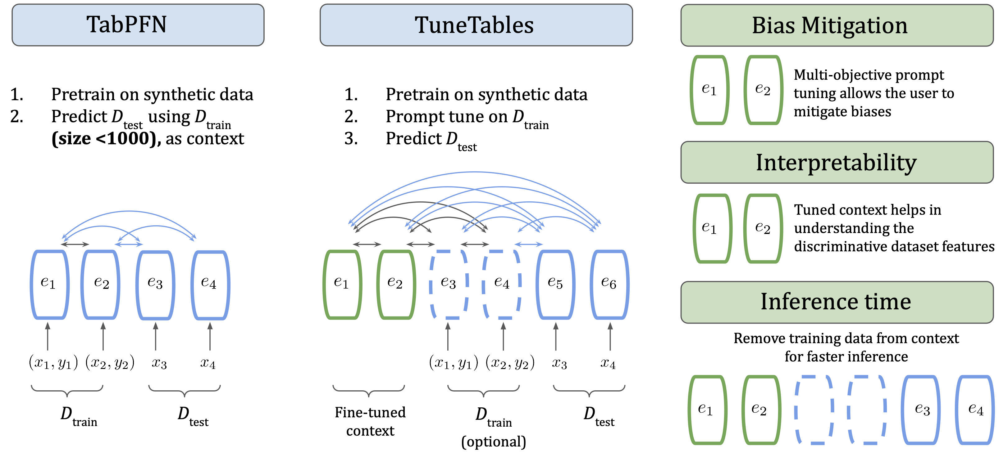

<br/>
<p align="center"></p>

----


We introduce TuneTables, a tabular classification algorithm that overcomes the limitations of prior-data fitted networks to achieve strong performance on large datasets.

While TabPFN achieves very strong performance on small tabular datasets, its current limitations include fewer than 1000 datapoints, fewer than 100 features, and fewer than 10 class labels. In this work, we overcome these limitations and substantially improve the performance of PFNs by developing context optimization techniques; specifically, we propose TuneTables, a novel prompt-tuning strategy. TuneTables scales TabPFN to be competitive with state-of-the-art tabular classification methods on larger datasets, while having additional benefits as well: (1) substantially lower inference time than TabPFN, (2) can be used as an interpretability tool, and (3) can mitigate biases by optimizing a fairness objective.

<p align="center"></p>

This codebase extends the excellent public repository [TabPFN](https://github.com/automl/tabpfn), by Noah Hollmann, Samuel Müller, Katharina Eggensperger, and Frank Hutter.

## Table of Contents
1. [Hardware Requirements](#hardware-requirements)
2. [Installation](#installation)
3. [Datasets](#datasets)
4. [Running Experiments](#running-experiments)

## Hardware Requirements

* Any modern Linux workstation should be compatible with the packages called by TuneTables.
* We recommend running TuneTables on a GPU. In our experiments, we use a single NVIDIA L4 with 24GB VRAM.

## Installation

1. Clone the TuneTables repository to your local instance.
2. Initialize a clean environment of your preference, E.G.:

```bash
conda create --name "TuneTables" python=3.10
```

3. From the TuneTables directory, run --

```bash
pip install . 
```

All commands should be run from within the `tunetables` directory.

```
cd tunetables
```

## Datasets

TuneTables was tested on over 40 datasets sourced from [OpenML](https://www.openml.org/). We recommend downloading some of the datasets listed in order to get familiar with our software.

### Dataset Preparation

In order to prepare your dataset(s) for TuneTables, we recommend following the dataset preparation steps outlined in the [TabZilla](https://github.com/naszilla/tabzilla?tab=readme-ov-file#datasets) repository, which we used in our experiments. We also include two preprocessed datasets, `openml__elevators__3711` and `openml__har__14970` in `TuneTables\sample_datasets`, for testing purposes.

### List of OpenML Datasets

An extended list of datasets we use for experiments are included below.

```
openml__Bioresponse__9910
openml__blood-transfusion-service-center__10101
openml__breast-cancer__145799
openml__BNG(labor)__2137
openml__BNG(vote)__212
openml__christine__168908
openml__Click_prediction_small__7294
openml__climate-model-simulation-crashes__146819
openml__colic__27
openml__connect-4__146195
openml__dilbert__168909
openml__dresses-sales__125920
openml__eeg-eye-state__14951
openml__elevators__3711
openml__har__14970
openml__higgs__146606
openml__poker-hand__9890
openml__riccardo__168338
openml__robert__168332
openml__volkert__168331
openml__balance-scale__11
openml__cmc__23
openml__cylinder-bands__14954
openml__heart-c__48
openml__kc1__3917
openml__Agrawal1__146093
openml__airlines__189354
openml__albert__189356
```

## Running Experiments

### Datasets

Dataset names are stored in plaintext files, newline separated. 

```
openml__airlines__189354
openml__albert__189356
```

Examples of task and dataset lists can be found in the `metadata` directory.

### Tasks

TuneTables jobs are organized into `tasks`, which are then executed in batches over a list of `datasets`. Examples of task and dataset lists can be found in the `metadata` directory. Here are some example tasks which can be included in a TuneTables batch.

```bash
ft #fine tune TabPFN end-to-end
pt10 #learn a prompt with an embedding of dimensions (10, ndim)
pt1000-10ens-randinit-avg-top2-reseed #learn an ensemble of 10 prompts, each randomly initialized, with reseeded data
tunetables-long #the algorithm collection used for the results in our paper (note -- this will be slow on large datasets!)
tunetables-short #an abbreviated version of TuneTables which runs much faster on large datasets, at the cost of some accuracy
```

The complete list of prompt-tuning and fine-tuning tuning tasks can be found in `tunetables/batch/all_tasks.py`.

### Zero-Shot Tasks

It is also possible to run zero-shot TabPFN tasks via TuneTables, across a range of context sizes, ensemble sizes, feature subsampling methods. Here are some example zero-shot tasks which can be included in a TuneTables batch.

```bash
zs-pca_white-32 #ensemble size 32, feature selection via principal component analysis with whitening
zs-sparse_random_projection-16 #ensemble size 16, feature selection via sparse_random_projection
zs-mutual_information-8 #ensemble size 8, feature selection via mutual information
```

### Jobs

As mentioned earlier, TuneTables `jobs` are organized into `tasks`, which are then executed in batches over a list of `datasets`. A task accepts as input a dataset in a valid format, and returns a suite of performance metrics for that dataset-task pair. Jobs are invoked via `batch\run_tt_job.py`.

Since prompt tuning requires a pretrained and frozen transformer, we need to `--resume` from a previous checkpoint. A TabPFN checkpoint is included in the repository: `models/prior_diff_real_checkpoint_n_0_epoch_42.cpkt`.

Also required is the `--base_path` where the datasets you wish to evaluate are stored.

Here is an example of how you might run a job in TuneTables:

```bash
python3 batch/run_tt_job.py --resume PATH/TO/CHECKPOINT --base_path PATH/TO/DATASETS --datasets PATH/TO/DATASET_TEXT --tasks PATH/TO/TASK_TEXT
```

### Special Flags

The `run_tt_job` script accepts several special flags. We describe their function here.

`--splits`: A space-separated list of splits to evaluate for each dataset, `0` by default. Our results are usually reported on an average: `--splits 0 1 2`.

`--real_data_qty`: Controls how much of the dataset is passed as context to the model during validation (`C / CT` setting only)

`--bptt`: Controls the length of the sequence passed to the model during training. When the task type is uniform, `bptt` is processed as a constant. When the task type is non-uniform, `bptt` is processed as the argmax of a random variable.

`--verbose`: If you pass this argument, TuneTables will log a lot more information about your runs to the console. This is useful for debugging or digging into the code.

`--print_stdout`: If you pass this argument, TuneTables will print stdout and stderr to the console after each task completes.

## Citation

Please cite our [paper](https://arxiv.org/abs/2402.11137) if you use the code or model in this repo.

```bibtex
@article{feuer2024tunetables,
  title={TuneTables: Context Optimization for Scalable Prior-Data Fitted Networks},
  author={Feuer, Benjamin and Schirrmeister, Robin Tibor and Cherepanova, Valeriia and Hegde, Chinmay and Hutter, Frank and Goldblum, Micah and Cohen, Niv and White, Colin},
  journal={arXiv preprint arXiv:2402.11137},
  year={2024}
}
```
